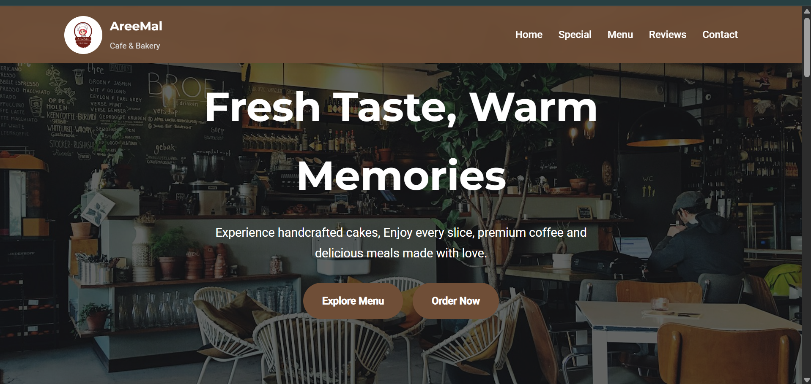
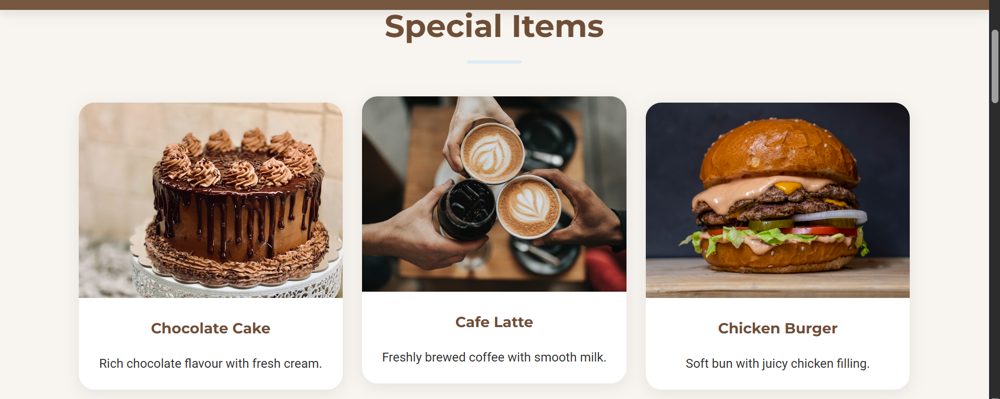
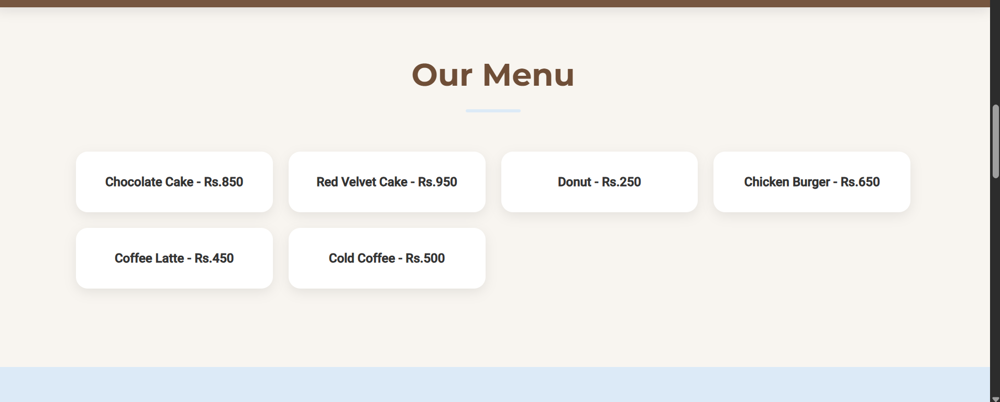
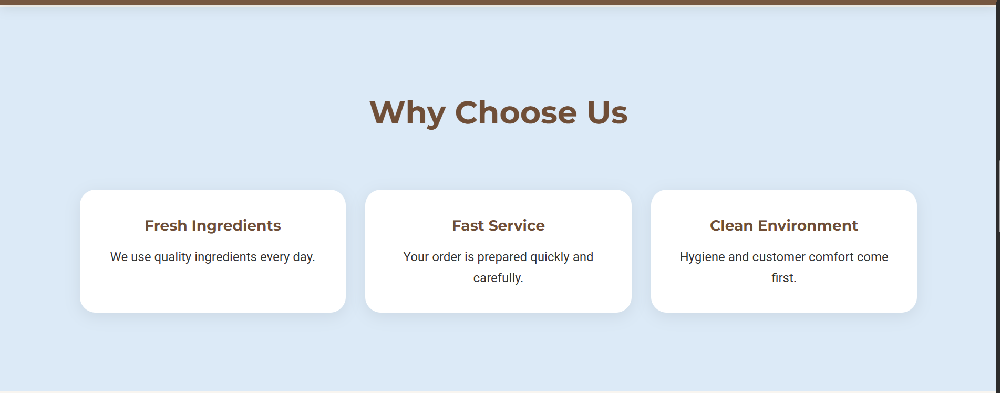
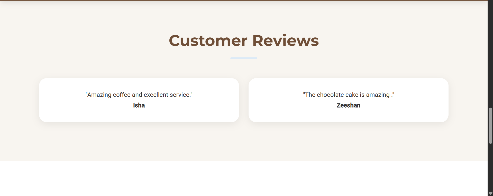
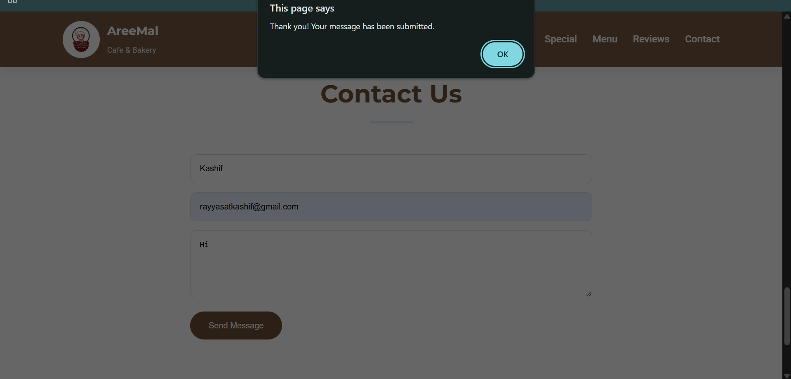

# DecodeLabs Project 01 - AreeMal Cafe & Bakery

## Project Description

A responsive Cafe & Bakery website developed using HTML, CSS and JavaScript.

The website includes:

- Responsive Navigation Bar
- Hero Section
- Special Items Section
- Menu Section
- Customer Reviews
- Contact Form
- Smooth Scrolling Navigation

## Technologies Used

- HTML5
- CSS3
- JavaScript

## Project Files

- index.html
- style.css
- script.js
- images/logo.jpeg

  
## Screenshots

### Home Section

### Special Items

### Menu Section

### Why Choose Us

### Customer Reviews

### Contact Section

## Author

Malyika Riasat
